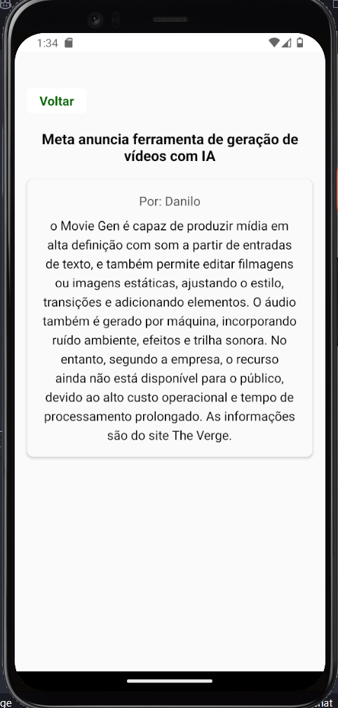

# Tech Challenge - Fase 04

## Grupo
* - Danilo Soares da Silva - RM:354317*
* - Gabriel Antunes – RM: 354712
* - Lucas dos Santos Melo – RM:355274*
* - Lucas Souza Davanso – RM: 354925*
* - Paloma Cristina da Silva Correa – RM:355519*


## Índice
- [Descrição do Projeto](#descrição-do-projeto)
- [Requisitos Técnicos](#requisitos-técnicos)
- [Página Principal (Lista de Posts)](#página-principal-lista-de-posts)
- [Página de Leitura de Post](#página-de-leitura-de-post)
- [Página de Criação de Postagens](#página-de-criação-de-postagens)
- [Página de Edição de Postagens](#página-de-edição-de-postagens)
- [Página Administrativa](#página-administrativa)
- [Autenticação e Autorização](#autenticação-e-autorização)
- [Como Executar o Projeto](#como-executar-o-projeto)
- [Contribuição](#contribuição)


## Descrição do Projeto
Este projeto visa desenvolver uma interface gráfica intuitiva para gerenciar postagens, utilizando as tecnologias React Native. A aplicação permite a criação, edição e leitura de posts, além de funcionalidades administrativas.

## Requisitos Técnicos
A interface foi desenvolvida com **React Native**. A integração é feita com a API desenvolvida na fase 2:

## Requisitos Funcionais

### Página de Login
- Permitir que o usuário se autentique
- Permitir que um usuário se cadastre


### Página de Cadastro
- Página de Cadastro de usuário


### Página de visualização de Posts como aluno
- Exibir uma lista contendo todos os posts.


### Página de Leitura de Post como Aluno
- Exibir o conteúdo completo de um post selecionado.


### Página de Leitura de Post como Professor
- Exibir o conteúdo completo de um post selecionado.
- Botão para editar e excluir o post.


### Página de Criação de Postagens
- Formulário para que docentes possam criar postagens.
- Campos para título, conteúdo e autor.
- Botão para enviar o post ao servidor.


### Página de Edição de Postagens
- Formulário para que os(as) professores(as) possam editar postagens existentes.
- Carregar os dados atuais do post para edição.
- Botão para salvar as alterações.


### Página Administrativa de Alunos
- Permitir que o admin altere o perfil ou exclua os alunos


### Página Administrativa de Professores
- Permitir que o admin altere o perfil ou exclua os professores


### Página de Configuração de Usuário
- Permitir que usuários alterem as configurações de sua conta


## Apresentação


- Caminho > *src/assets/apresentacao.zip*

## API consumida neste projeto
- Para facilitar as consultas, hospedamos a API na Vercel
[Repositório API Fase 2](https://github.com/LpldFiap/StudyTech.git)

## Como Executar o Projeto
1. Clone o repositório da API:

```bash
git clone https://github.com/LpldFiap/StudyTech.git

